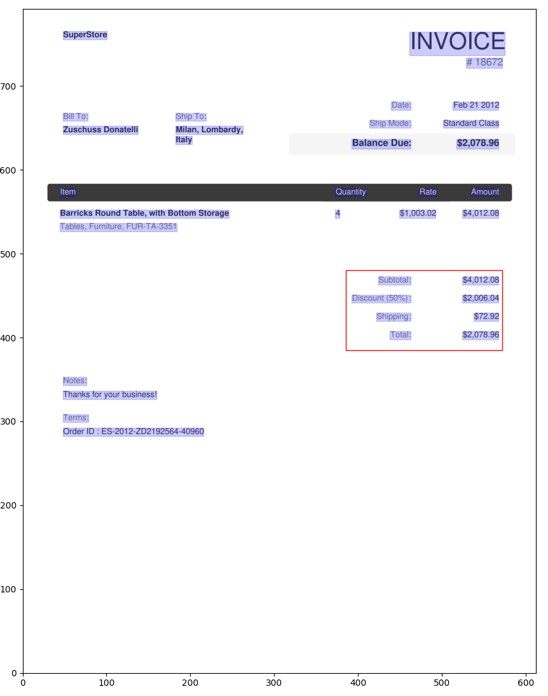

# EXTRACTING INVOICE DATA FROM PDF

### MOTIVATION
Many companies cannot afford or do not have access to robust cloud systems like AWS with Textract, limiting their ability to process PDF files efficiently. A common challenge faced by these companies is the need to extract data from PDF without the appropriate tools, leading to high costs and time-consuming manual work.
This project aims to explore how Python libraries can be leveraged to automate this process, generating value by reducing manual effort and enabling analysts to save valuable time, which would otherwise be spent processing files for days.

### CONTEXT 
A medium-sized company has a corporate logistics department responsible for managing operations at the strategic level.
Their largest supplier, which accounts for 85% of the operation, can only send reports on a monthly basis. However, they have recently been able to send automated invoices in PDF format almost instantly as invoices are generated by their system.
The department manager requires weekly reports for forecasting and quick decision-making. Currently, over 1000 PDF files processing is done manually by two employees, who spend at least three days to complete the report. The situation is about to get worse as the company is increasing the operations and more PDFs will be available.
As a Data Engineer in the newly created Data Team, I am tasked with finding a solution to automate this process.

### OBJECTIVE
1. Extract data from the PDF with python (locally);
2. Perform data wrangling and cleaning to ensure consistency;
3. Generate a single CSV file for data analysts to work with
4. Next: upload data to the DW.

### CHALLENGES
PDFs may have slight differences in positioning of the elements
Not all data is presented in a tabular format
Some invoices may have missing data

### SOLUTION
1. Use `matplotlib` to analyze how `camelot` reads the document and to adjust the positioning of elements.
2. Use Pandas for data wrangling.
3. Upload the cleaned data to a PostgreSQL database.
4. Automate the process using Airflow for scheduling and task orchestration.

### RESULTS
After one week of development, the solution is now ready for deployment and has been successfully tested.
The two business analysts are now free from the burden of manual PDF processing and can focus on higher-value tasks, significantly boosting the department's overall efficiency.
To quantify the impact, consider the following:
Each Business Analyst’s hourly rate is $25, and previously, they spent an average of 24 hours per week on this task. This amounted to approximately $1,200 per week, or $60,000 annually, on a time-consuming and low-value activity.
However, the benefits are not solely financial. By automating this task, the company not only saves significant costs but also improves employee satisfaction. The analysts no longer need to spend their time on repetitive and monotonous work, leading to a more motivated and engaged workforce. Although the satisfaction improvement is harder to quantify, it can be considered a significant intangible benefit that positively impacts overall team morale and productivity.

### IMAGES
The invoice structure: \

Invoice interpretation of summary: \

**First look at extraction of the summary:**

	

  
**Final table:**

	

### **Main Language:**  
Python:  

	
